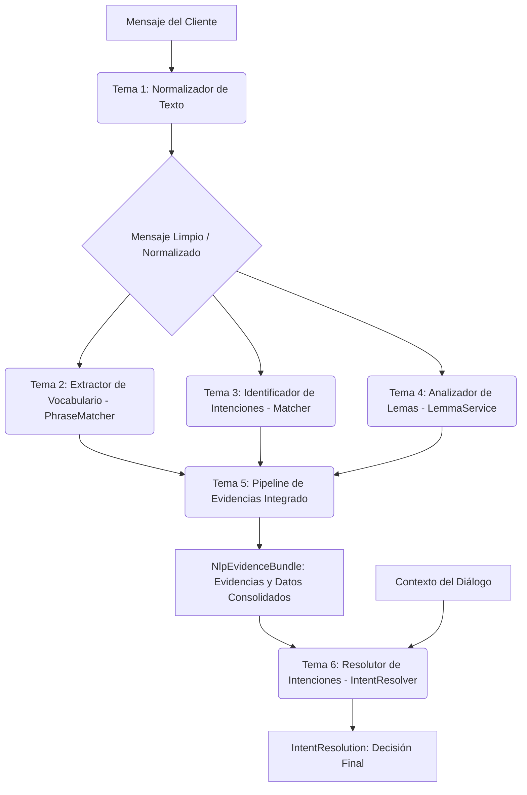

# Arquitectura Técnica: Procesador NLP del Restaurante

Este documento detalla la arquitectura técnica, las responsabilidades de los componentes y el flujo de ejecución del procesamiento de lenguaje natural (NLP) del chatbot del restaurante.

---

## Flujo General del Pipeline

El procesamiento de cada mensaje entrante del usuario sigue una secuencia estrictamente ordenada que integra todos los módulos:

---

## Tema 1: Normalizador de Texto (Limpiador)

### 1. Responsabilidades del Normalizador
*   **Unicode e Integridad**: Estandariza la codificación a la forma Unicode `NFC`.
*   **Limpieza de Ruido**: Convierte el texto a minúsculas y estandariza los espacios alrededor de los signos de puntuación.
*   **Reemplazo de Expresiones**: Convierte modismos pragmáticos, abreviaciones y errores comunes a sus formas canónicas en español colombiano.
*   **Extracción Monetaria**: Reconoce y extrae jergas de dinero como "lucas" (ej: "veinte lucas" $\rightarrow$ `$20,000 COP`).

### 2. Infraestructura de Carga (`src/infrastructure/loaders/normalizer_loader.py`)
Para evitar configuraciones monolíticas difíciles de mantener, las configuraciones del normalizador se dividen en 7 archivos JSON en `resources/normalizer/`:
*   `metadata.json`: Control administrativo del componente.
*   `options.json`: Interruptores booleanos de transformaciones técnicas.
*   `orthographic_replacements.json`: Correcciones individuales y aliases de palabras.
*   `phrase_replacements.json`: Reemplazos de modismos y frases compuestas.
*   `monetary_slang.json`: Multiplicadores para jerga de dinero.
*   `non_semantic_tokens.json`: Vocativos a depurar en fases posteriores.
*   `rules.json`: Reglas de integridad lógica.

### 3. Código Core (`src/infrastructure/services/normalizer_service.py`)
*   `TextNormalizer`: Clase principal que realiza la secuencia ordenada de normalización.
*   `NormalizationResult`: Contenedor inmutable de resultados, transformaciones y valores monetarios extraídos.

---

## Tema 2: Extractor de Vocabulario (PhraseMatcher)

### 1. Responsabilidades del PhraseMatcher
*   **Detección de Entidades**: Identifica términos estables del restaurante (como platos, ingredientes, categorías y alérgenos) utilizando la librería `spaCy` y su componente `PhraseMatcher` con comparación en minúsculas (`LOWER`).
*   **Resolución de Conflictos (Solapamientos)**: Si se detectan múltiples términos que comparten palabras (ej: "mojarra frita" activa tanto el producto específico `mojarra_frita` como el producto base `mojarra`), el PhraseMatcher aplica un algoritmo de resolución de solapamientos:
    *   **Longitud**: Los términos más largos tienen prioridad (ej. "mojarra frita" gana a "mojarra").
    *   **Prioridad**: A nivel de configuración de tipos de entidad (ej. `PRODUCTO_ESPECIFICO` tiene prioridad sobre `PRODUCTO_BASE`).
    *   **Orden de aparición**: En caso de empate absoluto, se conserva el primer término.

### 2. Infraestructura de Carga (`src/infrastructure/loaders/phrase_matcher_loader.py`)
*   Proporciona funciones genéricas de carga segura y validación (`load_json`) para el catálogo de entidades ubicado en `resources/phrase_matcher/catalog.json`.

### 3. Código Core (`src/infrastructure/services/phrase_matcher_service.py`)
*   `PhraseMatcherService`: Inicializa el objeto `PhraseMatcher` de `spaCy`, lee el catálogo de entidades, limpia frases duplicadas y ejecuta la extracción y resolución de solapamientos.
*   `PhraseEntity` and `PhraseMatchResult`: Estructuras de datos inmutables y tipadas que encapsulan las entidades detectadas y aquellas que fueron descartadas por solapamientos.

---

## Tema 3: Identificador de Intenciones (Matcher)

### 1. Responsabilidades del Matcher
*   **Identificación de Patrones**: Utiliza el motor de `Matcher` de `spaCy` para encontrar reglas y patrones sintáctico-semánticos en el texto limpio (ej: preguntas sobre precios, deseos de reserva, confirmación de pedidos).
*   **Extracción de Evidencias**: No toma decisiones definitivas sobre intenciones únicas, sino que extrae candidatas o "evidencias" con pesos de probabilidad basados en el patrón encontrado.
*   **Extracción de Datos Complementarios**: Analiza tokens numéricos y palabras clave para registrar cantidades y montos de dinero ("lucas", "mil pesos"), así como la presencia de negaciones que puedan alterar un plato.

### 2. Infraestructura de Carga (`src/infrastructure/loaders/matcher_loader.py`)
*   Carga el catálogo estructurado de patrones de intenciones desde `resources/matcher/catalog.json`.

### 3. Código Core (`src/infrastructure/services/matcher_service.py`)
*   `MatcherService`: Clase encargada de registrar los patrones en `spaCy`, coordinar con `PhraseMatcherService` para tener anotados los tokens de entidades, y analizar las sentencias generando evidencias con sus pesos.
*   `MatcherEvidence`, `StructuredExtraction` y `MatcherResult`: Clases inmutables que encapsulan las intenciones candidatas, las cantidades detectadas y las entidades de vocabulario integradas en un único resultado.

---

## Tema 4: Analizador de Lemas (LemmaService)

### 1. Responsabilidades del LemmaService
*   **Lematización Morfológica**: Reduce palabras flexionadas o conjugadas a su forma canónica (lema) en español.
*   **Resolución Híbrida**: Combina el motor de lematización nativo de `spaCy` (usando el modelo `es_core_news_sm`) con un catálogo controlado de lemas/formas (`lemma_catalog.json`) como fallback.
*   **Prioridad de Catálogo**: Si un término normalized o su lema de spaCy está registrado en el catálogo, se prioriza el lema canónico del catálogo para asegurar alineación con la jerga de negocio (ej. "gracias" -> "agradecer", "alérgica" -> "alérgico").
*   **Extracción de Evidencias Secundarias**: Genera evidencias ponderadas con pesos de intención bajos (ej. "costar" -> `consultar_precio` peso 0.15) como señal de soporte para otros módulos.

### 2. Infraestructura de Carga (`src/infrastructure/loaders/lemma_loader.py`)
*   Carga la configuración y el catálogo de lemas estructurado desde `resources/lemma/catalog.json`.

### 3. Código Core (`src/infrastructure/services/lemma_service.py`)
*   `LemmaService`: Inicializa el modelo de spaCy, lee el catálogo, construye índices inversos de formas a lemas, y analiza textos para retornar tokens resueltos con sus fuentes (`spacy`, `catalog_fallback`, `surface`) y evidencias asociadas.
*   `LemmaToken`, `LemmaEvidence` y `LemmaAnalysisResult`: Clases inmutables que representan las estructuras de datos de la lematización.

---

## Tema 5: Pipeline de Evidencias Integrado (NlpEvidencePipeline)

### 1. Responsabilidades de NlpEvidencePipeline
*   **Orquestación Secuencial**: Coordina la ejecución ordenada de los cuatro servicios previos:
    1. Normaliza el texto de entrada.
    2. Ejecuta el `PhraseMatcher` sobre el texto normalizado.
    3. Ejecuta el `Matcher` sobre el texto normalizado.
    4. Ejecuta el `LemmaService` sobre el texto normalizado.
*   **Consolidación en Bundle**: Empaqueta los resultados en un objeto unificado `NlpEvidenceBundle` que contiene todo el contexto necesario para que el resolutor de intenciones tome la decisión final de diálogo.

### 2. Código Core (`src/application/nlp_pipeline.py`)
*   `NlpEvidencePipeline`: Orquestador principal del pipeline.
*   `NlpEvidenceBundle`: Contenedor inmutable que almacena el texto original, texto normalizado, y los diccionarios de resultados del normalizador, phrase_matcher, matcher y lemas.

---

## Tema 6: Resolutor de Intenciones (IntentResolver)

### 1. Responsabilidades del IntentResolver
*   **Resolución de Intención**: Acumula evidencia por intención y subintención de los diferentes servicios (Matcher, PhraseMatcher y LemmaService).
*   **Políticas de Prioridad y Precedencia**:
    1.  *Seguridad Alimentaria*: Prioriza intenciones sobre alérgenos o contaminación cruzada por encima del catálogo, precio o pedidos.
    2.  *Precio Explícito*: Las consultas de precio explícitas con un plato presente ganan a la intención genérica de "querer".
    3.  *Presupuesto*: Prioriza recomendaciones basadas en el dinero disponible si se mencionan montos/jerga de presupuesto.
    4.  *Negación con Ingrediente*: Identifica solicitudes de modificación (sin ajo, sin cebolla).
    5.  *Historial del Menú*: Reconoce solicitudes de reenvío de menú ("otra vez") apoyándose en el contexto previo.
*   **Aclaración de Ambigüedades**: Identifica si las dos intenciones con mayor puntaje están muy cerca en probabilidad y solicita aclaración.
*   **Requerimientos Faltantes**: Valida si falta información indispensable (ej: si se detecta consulta de precio pero no se menciona ningún producto, solicita aclaración).

### 2. Código Core (`src/infrastructure/services/intent_resolver_service.py`)
*   `IntentResolver`: Combina evidencias y el contexto de diálogo para emitir la resolución final.
*   `CandidateScore` e `IntentResolution`: Representan las puntuaciones calculadas y la resolución resultante.

---

## Tema 7: Pipeline de Análisis Resuelto (ResolvedNlpPipeline)

### 1. Responsabilidades de ResolvedNlpPipeline
*   **Patrón Facade**: Consolida la ejecución de `NlpEvidencePipeline` (extracción de evidencias lingüísticas) y de `IntentResolver` (aplicación de reglas y contexto) en un único punto de entrada.

### 2. Código Core (`src/application/resolved_pipeline.py`)
*   `ResolvedNlpPipeline`: Orquestador que expone la interfaz unificada `analyze(text, context)`.
*   `ResolvedNlpResult`: Contenedor de la evidencia obtenida y su resolución final.

---

## Límites de Diseño Generales

*   **Evidencias y no decisiones finales**: Ningún módulo de NLP toma decisiones finales sobre intenciones ni responde directamente al cliente. Todo se expone como evidencias estructuradas con pesos.
*   **Sin corrector ortográfico general libre**: No se usan algoritmos heurísticos aproximados (como distancia de Levenshtein genérica) para no alterar nombres de platos y calles propios del restaurante. Todo reemplazo es determinista y controlado por catálogo.
*   **Conservación de negaciones**: Se detectan y exponen las palabras críticas de negación ("no", "sin") en el resultado de la extracción para que el bot entienda ingredientes omitidos.esultado de la extracción para que el bot entienda ingredientes omitidos.
