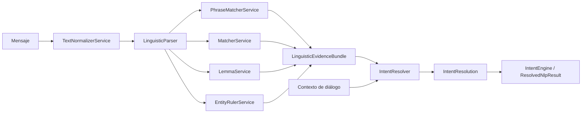

# Arquitectura técnica de `core_nlp_engine`

El motor separa extracción lingüística y resolución de negocio. Los servicios de infraestructura producen evidencia; la capa de aplicación coordina el flujo y decide la intención final.

## Flujo general



`LinguisticParser` ejecuta una sola vez el `PhraseMatcher` y entrega el resultado a `MatcherService`, evitando repetir esa búsqueda. `EntityRulerService` usa el componente nativo `entity_ruler` de spaCy y también permite anotar un `Doc` in-place.

## Recursos

Cada responsabilidad tiene un recurso auditable:

- `config/domain/intent_taxonomy.json`: vocabulario canónico de intenciones y subintenciones del dominio.
- `config/domain/slot_catalog.json`: datos semánticos requeridos por las intenciones, sin importar si provienen del mensaje o del contexto.
- `config/infrastructure_nlp/text_normalizer_service_config.json`: variación gráfica, alias y jerga.
- `config/infrastructure_nlp/phrase_matcher_service_config.json`: vocabulario comercial estable reconocido por `PhraseMatcherService`.
- `config/infrastructure_nlp/matcher_service_config.json`: estructuras tokenizadas y extracciones sintácticas.
- `config/infrastructure_nlp/lemma_service_config.json`: lemas y formas como evidencia secundaria.
- `config/infrastructure_nlp/entity_ruler_service_config.json`: tiempo y referencias contextuales.
- `config/application/intent_resolver_config.json`: pesos, prioridades y fuentes de evidencia.
- `config/application/conversation_action_rules.json`: acciones posibles, reglas por intención y subintención, y preguntas asociadas.
- `business_data/menu/menu_offerings.json`: precios, presentaciones y recomendaciones enlazados por `product_id`.
- `business_data/restaurant/restaurant_profile.json`: información estable del restaurante.
- `corpus/benchmarks/customer_intent_benchmark.json`: benchmark conocido de 600 casos para medir el sistema.
- `corpus/conversations/`: flujos sintéticos compuestos únicamente por mensajes de clientes.
- `corpus/datasets/`: material futuro para entrenar, validar y probar modelos.
- `corpus/profiles/conversation_profiles.json`: 20 estilos conversacionales para diseño y evaluación, fuera del runtime.

La política completa se documenta en `resources/README.md`. Cada servicio carga de forma autónoma su archivo o un diccionario. `IntentResolver` carga por separado sus puntajes y la política conversacional. Los perfiles no se inyectan al parser ni al resolutor. `tests/contract/test_resource_contract.py` verifica referencias contra la taxonomía, cobertura, preguntas, slots, duplicados y fronteras de propiedad.

## Infraestructura

Los servicios lingüísticos viven en `src/infrastructure/nlp/`.

- `TextNormalizerService`: normalización Unicode, reemplazos deterministas, espacios y jerga monetaria.
- `PhraseMatcherService`: vocabulario estable de negocio y resolución de solapamientos.
- `MatcherService`: patrones sintácticos, evidencias, cantidades, dinero y negación.
- `LemmaService`: lematización de spaCy con fallback controlado de formas.
- `EntityRulerService`: días, fechas, momentos del día y referencias contextuales nativas.

Estos componentes no eligen la intención final ni generan respuestas comerciales.

## Aplicación

- `LinguisticParser` y `LinguisticEvidenceBundle`, en `src/application/linguistic_parser.py`, coordinan las cinco fuentes lingüísticas.
- `IntentResolver`, `CandidateScore` e `IntentResolution`, en `src/application/intent_resolver.py`, aplican pesos, prioridades, requisitos y contexto conversacional.
- `IntentEngine` y `ResolvedNlpResult`, en `src/application/intent_engine.py`, forman la fachada pública para `analyze(text, context)`.

El resolutor combina las entidades del catálogo con las del `EntityRuler`. Así, las referencias contextuales se mantienen desacopladas del catálogo comercial.

## Límites de diseño

- Las transformaciones y patrones son deterministas y configurables.
- La negación se conserva como evidencia.
- Los servicios lingüísticos no consultan precios, inventario ni disponibilidad.
- La resolución no redacta la respuesta al cliente.
- La configuración puede inyectarse como diccionario para pruebas sin acceso al sistema de archivos.

## Verificación

```bash
python -m unittest discover -s tests -p "test_*.py"
python -X utf8 tests/evaluation/evaluate_resolver.py
```
