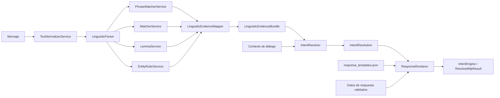

# Arquitectura técnica de `core_nlp_engine`

El motor separa extracción lingüística y resolución de negocio. Los servicios de infraestructura producen señales y entidades neutrales; la capa de aplicación las convierte en evidencia y decide la intención final.

## Flujo general



Los cuatro analizadores posteriores a la normalización son independientes. `MatcherService` y `LemmaService` producen señales neutrales; `LinguisticEvidenceMapper`, en aplicación, las relaciona con entidades e intenciones. `EntityRulerService` usa el componente nativo `entity_ruler` de spaCy.

## Recursos

Cada responsabilidad tiene un recurso auditable:

- `src/temp/resources/intent_resolver/intents_and_subintents.json`: 12 intenciones, 56 subintenciones canónicas, prioridades de desempate y parámetros técnicos de resolución, temporalmente en revisión.
- `src/temp/resources/intent_resolver/conversation_data_fields.json`: campos de datos conversacionales, temporalmente en revisión.
- `src/infrastructure/resources/text_normalizer_service_config.json`: variación gráfica, alias y jerga.
- `src/infrastructure/resources/phrase_matcher_service_config.json`: vocabulario comercial estable reconocido por `PhraseMatcherService`.
- `src/infrastructure/resources/matcher_service_config.json`: estructuras tokenizadas y extracciones sintácticas.
- `src/infrastructure/resources/lemma_service_config.json`: lemas y formas flexionadas neutrales.
- `src/infrastructure/resources/entity_ruler_service_config.json`: tiempo y referencias contextuales.
- `src/temp/resources/intent_resolver/linguistic_evidence_mapping.json`: traducción de señales y entidades de infraestructura a evidencia ponderada de intenciones.
- `src/temp/resources/intent_resolver/conversation_action_rules.json`: acciones, reglas y preguntas, temporalmente en revisión.

Los cuatro contratos se ubican juntos porque participan en la resolución, pero no forman una dependencia circular. `LinguisticEvidenceMapper` carga únicamente `linguistic_evidence_mapping.json`: sus referencias se validan contra `intents_and_subintents.json` y sus claves de señal contra los recursos de infraestructura; no conoce campos, preguntas ni acciones. `IntentResolver` recibe la carpeta `src/temp/resources/intent_resolver/`, carga los otros tres JSON y rechaza al iniciar reglas con pares de intención o campos no declarados. Las prioridades, los umbrales y los multiplicadores están integrados en `intents_and_subintents.json` para evitar duplicar identificadores de intención.
- `src/temp/resources/response_templates.json`: plantillas, valores requeridos y selección para los 20 pares que pueden finalizar directamente en `resolved`.
- `business_data/menu/menu_offerings.json`: precios, presentaciones y recomendaciones enlazados por `product_id`.
- `business_data/restaurant/restaurant_profile.json`: información estable del restaurante.
- `corpus/benchmarks/customer_intent_benchmark.json`: benchmark conocido de 600 casos para medir el sistema.
- `corpus/conversations/`: flujos sintéticos compuestos únicamente por mensajes de clientes.
- `corpus/datasets/`: material futuro para entrenar, validar y probar modelos.
- `corpus/profiles/conversation_profiles.json`: 20 estilos conversacionales para diseño y evaluación, fuera del runtime.

La política completa se documenta en `resources/README.md`. Cada servicio carga de forma autónoma su archivo o un diccionario. `IntentResolver` carga por separado sus puntajes y la política conversacional. Los perfiles no se inyectan al parser ni al resolutor. `tests/temp/json_validators/test_resource_json_validator.py` verifica referencias contra la taxonomía, cobertura, preguntas, slots, duplicados y fronteras de propiedad.

`tests/temp/json_validators/test_menu_offerings_json_validator.py` valida de manera independiente la estructura vigente de productos, ofertas, precios y recomendaciones.

`tests/temp/json_validators/test_restaurant_profile_json_validator.py` valida por separado la metadata, identificación, dirección, zona horaria, horarios y medios de pago del restaurante.

## Infraestructura

Los servicios lingüísticos viven en `src/infrastructure/nlp/`.

- `TextNormalizerService`: normalización Unicode, reemplazos deterministas, espacios y jerga monetaria.
- `PhraseMatcherService`: vocabulario estable de negocio y resolución de solapamientos.
- `MatcherService`: señales sintácticas neutrales, cantidades, dinero y negación.
- `LemmaService`: lematización de spaCy y señales neutrales con fallback controlado.
- `EntityRulerService`: días, fechas, momentos del día y referencias contextuales nativas.

Estos componentes no eligen la intención final ni generan respuestas comerciales.

## Aplicación

- `LinguisticEvidenceMapper`, en `src/temp/linguistic_evidence_mapper.py`, combina señales neutrales y entidades, y allí asigna intención, subintención y peso.
- `LinguisticParser` y `LinguisticEvidenceBundle`, en `src/temp/linguistic_parser.py`, coordinan las cinco fuentes lingüísticas mientras esta capa permanece en revisión.
- `IntentResolver`, `CandidateScore` e `IntentResolution`, en `src/temp/intent_resolver.py`, aplican pesos, prioridades, requisitos y contexto conversacional.
- `ResponseRenderer` y `RenderedResponse`, en `src/temp/response_renderer.py`, conservan preguntas y confirmaciones ya resueltas o renderizan una respuesta directa sin inventar datos faltantes.
- `IntentEngine` y `ResolvedNlpResult`, en `src/temp/intent_engine.py`, forman la fachada pública provisional para `analyze(text, context, response_values)`.

El resolutor combina las entidades del catálogo con las del `EntityRuler`. Así, las referencias contextuales se mantienen desacopladas del catálogo comercial.

## Límites de diseño

- Las transformaciones y patrones son deterministas y configurables.
- La negación se conserva como evidencia.
- Los servicios lingüísticos no consultan precios, inventario ni disponibilidad.
- La resolución no redacta la respuesta al cliente.
- La configuración puede inyectarse como diccionario para pruebas sin acceso al sistema de archivos.

## Verificación

```bash
python -m unittest discover -s tests -p "test_*.py"
python -X utf8 tests/temp/evaluation/evaluate_resolver.py
```
