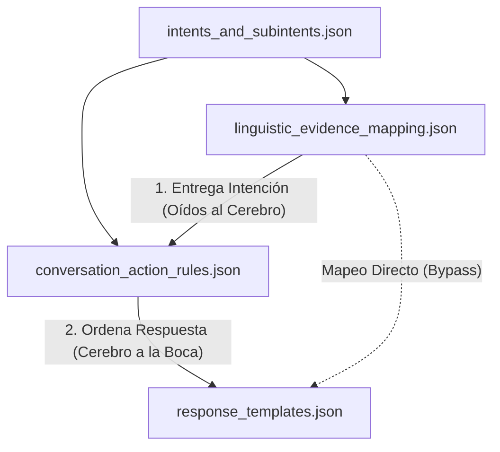
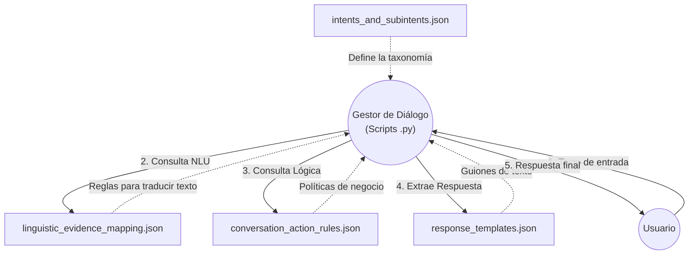
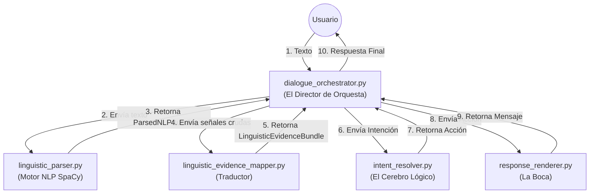
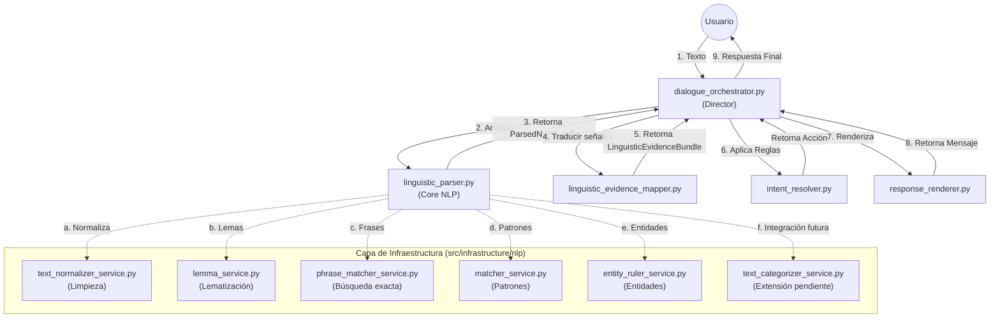
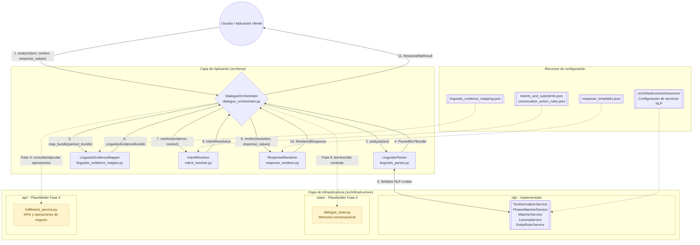

# Jerarquía y Flujo Conceptual de Recursos (temp/resources)

Este documento representa cómo interactúan las definiciones de origen, tanto a nivel conceptual (entre los archivos JSON) como a nivel técnico (con el código Python).

## 1. Flujo Conceptual (Solo Archivos JSON)
Este diagrama muestra la relación lógica entre los archivos de configuración. Muestra cómo la información viaja desde la taxonomía hasta convertirse en una respuesta (El ciclo de "Oídos al Cerebro a la Boca"):

## 2. Flujo de Arquitectura y Ejecución (Python + JSON)
Este diagrama muestra la realidad técnica. Los archivos JSON no tienen vida propia; son consumidos como "manuales de instrucciones" por el Gestor de Diálogo (los scripts `.py`).

### Explicación del Flujo (Arquitectura)

1. **El Origen Semántico (`intents_and_subintents.json`)**: Es el punto de inicio. Define las intenciones y subintenciones de negocio. Esta taxonomía fluye hacia abajo para estructurar:
   * Las reglas que mapean palabras reales a intenciones (`linguistic_evidence_mapping.json`).
   * Las acciones que guían la conversación cuando se detecta esa intención (`conversation_action_rules.json`).

2. **El Puente NLU $\rightarrow$ NLG (`response_templates.json`)**:
   * Cuando el modelo identifica una intención en `linguistic_evidence_mapping.json` (ej: `pedido.cancelar_pedido`), el Gestor de Diálogo cruza el puente utilizando el mapa `direct_response_by_intent_and_subintent`.
   * Esto conecta el ID de la intención NLU directamente con el ID de la plantilla NLG (ej: `order_cancel_confirm`).
   * Aquí mismo se definen las variables (`required_values`) que el sistema debe extraer (ej. `{product}`) para poder entregar la respuesta.

3. **Coherencia Cruzada (Reglas $\leftrightarrow$ Plantillas)**: 
   * Trabajan en equipo (representado por la flecha doble). Si el flujo conversacional de una intención termina sin lanzar una acción especial en las reglas, el sistema exige que exista obligatoriamente una plantilla de respuesta directa para ese caso en los templates.

## 3. Flujo de Orquestación Interna (Solo Scripts de Python)
Este diagrama detalla cómo `dialogue_orchestrator.py` hace visible el pipeline completo y mantiene independientes la extracción y la traducción de señales:

## 4. Detalle de la Infraestructura NLP
Este diagrama hace un "zoom" dentro de `linguistic_parser.py` para mostrar cómo se apoya en los servicios ubicados en `src/infrastructure/nlp`.

## 5. Flujo Completo con Capa de Infraestructura

Este es el mapa consolidado del sistema. Las flechas continuas representan el flujo implementado actualmente; las flechas discontinuas hacia Estado y APIs representan los puntos de extensión documentados para la Fase 4.

### Estado de cada bloque

| Bloque | Ruta | Estado |
|---|---|---|
| Servicios NLP | `src/infrastructure/nlp/` | Implementados e integrados mediante `LinguisticParser` |
| Estado conversacional | `src/infrastructure/state/dialogue_state.py` | Placeholder; todavía no es invocado |
| APIs y operaciones | `src/infrastructure/api/fulfillment_service.py` | Placeholder; todavía no es invocado |
| Pipeline de aplicación | `src/temp/` | Implementado hasta `ResolvedNlpResult` |
