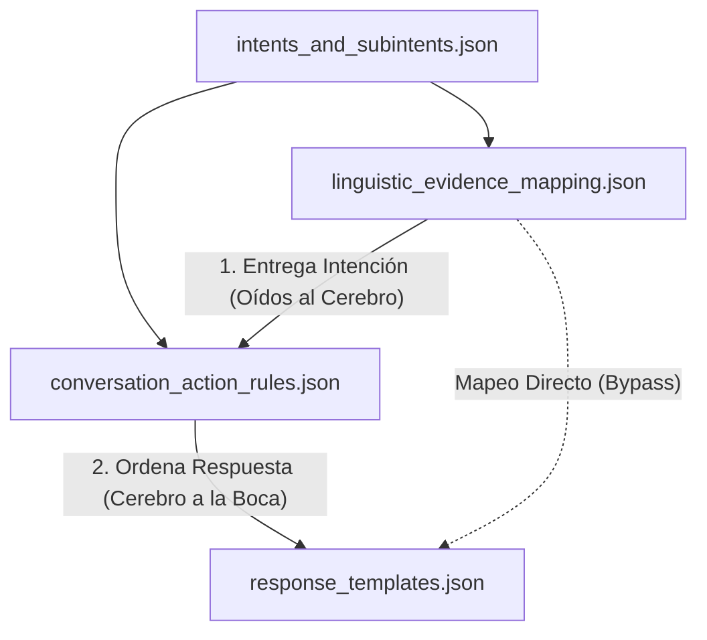
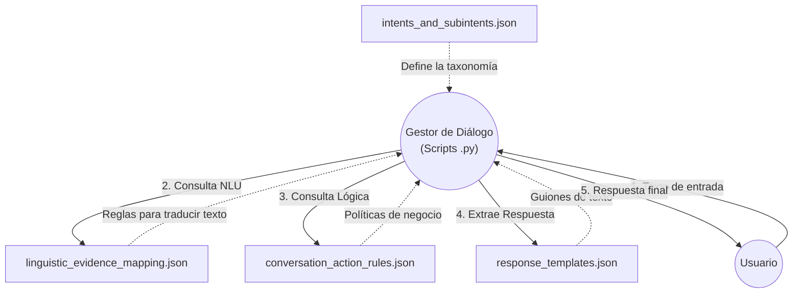
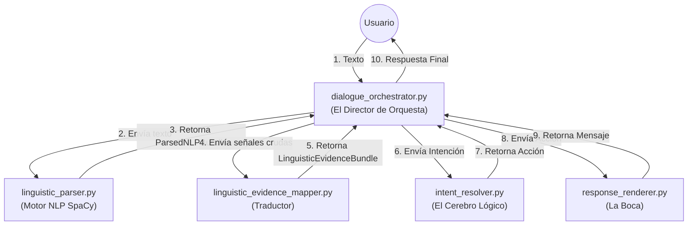
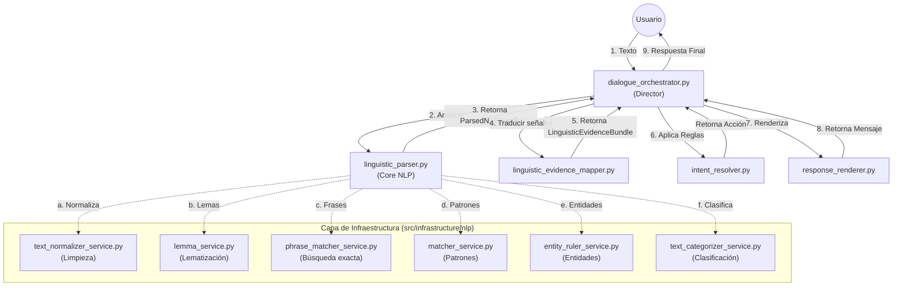
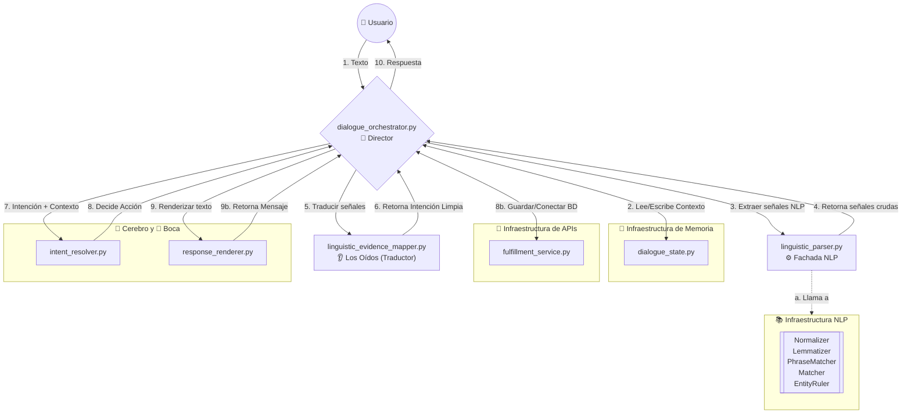
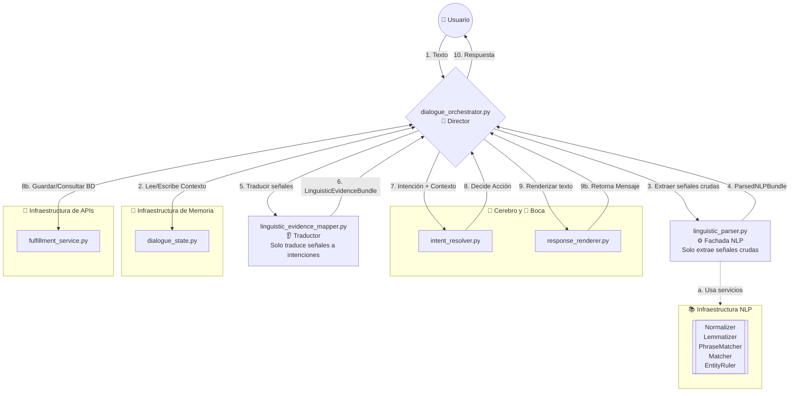

# Jerarquía y Flujo Conceptual de Recursos (temp/resources)

Este documento representa cómo interactúan las definiciones de origen, tanto a nivel conceptual (entre los archivos JSON) como a nivel técnico (con el código Python).

## 1. Flujo Conceptual (Solo Archivos JSON)
Este diagrama muestra la relación lógica entre los archivos de configuración. Muestra cómo la información viaja desde la taxonomía hasta convertirse en una respuesta (El ciclo de "Oídos al Cerebro a la Boca"):

## 2. Flujo de Arquitectura y Ejecución (Python + JSON)
Este diagrama muestra la realidad técnica. Los archivos JSON no tienen vida propia; son consumidos como "manuales de instrucciones" por el Gestor de Diálogo (los scripts `.py`).

### Explicación del Flujo (Arquitectura)

1. **El Origen Semántico (`intents_and_subintents.json`)**: Es el punto de inicio. Define las intenciones y subintenciones de negocio. Esta taxonomía fluye hacia abajo para estructurar:
   * Las reglas que mapean palabras reales a intenciones (`linguistic_evidence_mapping.json`).
   * Las acciones que guían la conversación cuando se detecta esa intención (`conversation_action_rules.json`).

2. **El Puente NLU $\rightarrow$ NLG (`response_templates.json`)**:
   * Cuando el modelo identifica una intención en `linguistic_evidence_mapping.json` (ej: `pedido.cancelar_pedido`), el Gestor de Diálogo cruza el puente utilizando el mapa `direct_response_by_intent_and_subintent`.
   * Esto conecta el ID de la intención NLU directamente con el ID de la plantilla NLG (ej: `order_cancel_confirm`).
   * Aquí mismo se definen las variables (`required_values`) que el sistema debe extraer (ej. `{product}`) para poder entregar la respuesta.

3. **Coherencia Cruzada (Reglas $\leftrightarrow$ Plantillas)**: 
   * Trabajan en equipo (representado por la flecha doble). Si el flujo conversacional de una intención termina sin lanzar una acción especial en las reglas, el sistema exige que exista obligatoriamente una plantilla de respuesta directa para ese caso en los templates.

## 3. Flujo de Orquestación Interna (Solo Scripts de Python)
Este diagrama detalla cómo `dialogue_orchestrator.py` hace visible el pipeline completo y mantiene independientes la extracción y la traducción de señales:

## 4. Flujo Completo con Capa de Infraestructura (Servicios NLP)
Para tener la fotografía completa del sistema, este diagrama hace un "zoom" dentro de los Oídos (`linguistic_parser.py`) para mostrar cómo se apoya en los distintos servicios de procesamiento natural ubicados en `src/infrastructure/nlp`.

## 5. Arquitectura del Futuro (Integración con APIs y Memoria)
Este diagrama muestra el mapa maestro definitivo de cómo se vería el sistema en la **Fase 4** (Conexión a Bases de Datos y Memoria), incluyendo todas las capas de infraestructura.

## 6. Arquitectura Recomendada (Orchestrator como Director Puro)
Este diagrama muestra la arquitectura aplicada al pipeline central: `DialogueOrchestrator` coordina a `LinguisticParser` y `LinguisticEvidenceMapper` de forma **separada e independiente**. Cada clase tiene exactamente un trabajo y el orquestador es el único que conoce el pipeline completo. `dialogue_state.py` y `fulfillment_service.py` ya existen como placeholders documentados; su implementación e integración continúan reservadas para la Fase 4 descrita en el diagrama 5.

### Diferencias clave vs. Diagrama 5

| Aspecto | Diagrama 5 (diseño anterior) | Diagrama 6 (pipeline aplicado) |
|---|---|---|
| **Quién orquesta NLU** | El Mapper llama al Parser internamente | `DialogueOrchestrator` coordina Parser y Mapper por separado |
| **Responsabilidad del Mapper** | Traduce Y coordina | Solo traduce |
| **Responsabilidad del Parser** | Solo extrae señales | Solo extrae señales ✅ |
| **Legibilidad del pipeline** | Oculto dentro del Mapper | Visible en `DialogueOrchestrator` |
| **Testabilidad** | Mapper necesita un Parser real o mock anidado | Cada clase se mockea de forma independiente |
