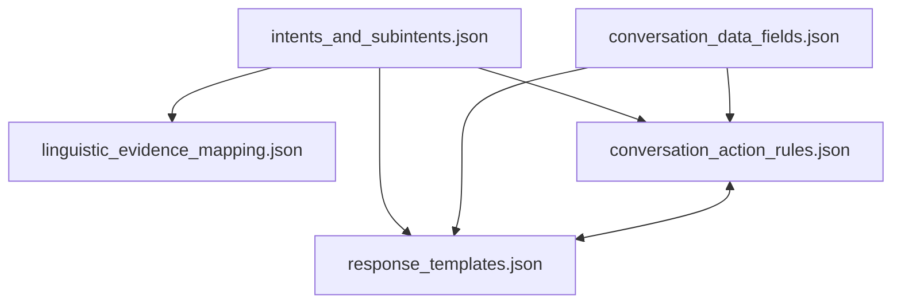

# Jerarquía y Flujo Conceptual de Recursos (temp/resources)

Este diagrama representa cómo las definiciones de origen (la Taxonomía y los Slots) fluyen hacia las reglas de mapeo, las acciones conversacionales y las plantillas de respuestas:

## Explicación del Flujo

1. **El Origen Semántico (`intents_and_subintents.json`)**: Es el punto de inicio. Define las intenciones y subintenciones de negocio. Esta taxonomía fluye hacia abajo para estructurar:
   * Las reglas que mapean señales físicas a intenciones (`linguistic_evidence_mapping.json`).
   * Las acciones que guían la conversación cuando se detecta esa intención (`conversation_action_rules.json`).
   * Cómo responder al usuario cuando finaliza el flujo (`response_templates.json`).

2. **El Origen de Datos (`conversation_data_fields.json`)**: Define las variables que necesitamos recolectar. Fluye hacia:
   * Las reglas de diálogo (`conversation_action_rules.json`) para indicar cuáles son campos obligatorios.
   * Las plantillas de respuesta (`response_templates.json`) para usarse como variables dinámicas (ej. `{product}`).

3. **Coherencia Cruzada (Reglas $\leftrightarrow$ Plantillas)**: 
   * Trabajan en equipo (representado por la flecha doble). Si el flujo conversacional de una intención termina sin lanzar una acción especial, el sistema exige que exista obligatoriamente una plantilla de respuesta directa para ese caso.
